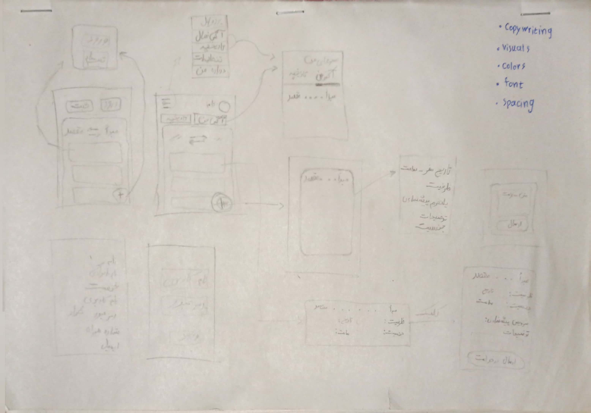
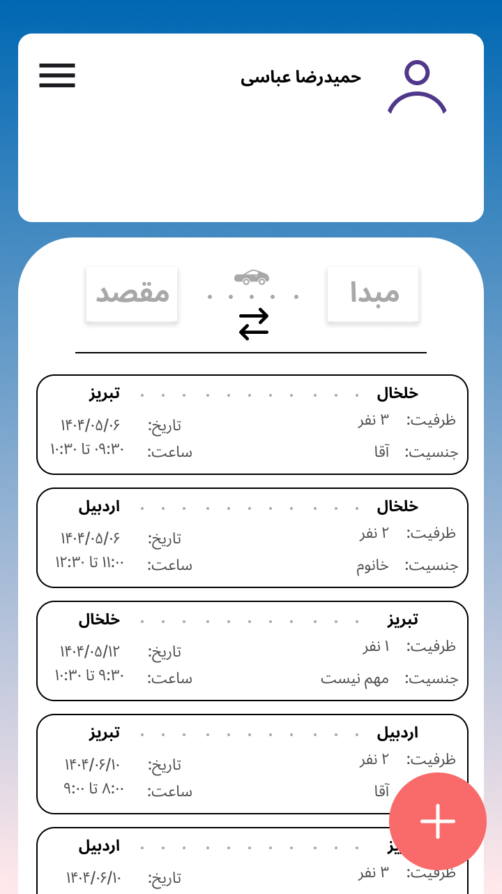

# rahtorah - راه‌ تو راه

## «راه‌ تو راه» چیه؟

«راه‌ تو راه» یک پلتفرم آنلاینه برای هماهنگی بین مسافرایی که مسیرشون یکیه!

> قصد اولیه‌ام از ساخت این پلتفرم، ایجاد فضایی برای دانشجوهای خوابگاهی بود که بین شهر محل زندگی و دانشگاهشون رفت‌وآمد می‌کنن؛ تا بین همه‌ی هزینه‌های سنگینی که دارن، بتونن از هزینه‌ی حمل‌ونقلشون کم کنن.  
> ولی بعد به این نتیجه رسیدم که بهتره این امکان برای همه‌ی افراد جامعه فراهم باشه.

---

## چرا «راه‌ تو راه»؟

این پلتفرم باعث صرفه‌جویی در هزینه‌های سفر می‌شه و در خیلی از موارد، حتی باعث می‌شه کیفیت سفر هم بالاتر بره!

سناریوهای زیادی هست که این پلتفرم می‌تونه توش مفید باشه؛ و هر کسی می‌تونه با دلیل خاص خودش واردش بشه.

---

## چطور؟

با وصل شدن به این پلتفرم، افراد می‌تونن آگهی‌های مسافرهایی که قصد سفر دارن و مسیرشون یکیه رو پیدا کنن و بهشون بپیوندن.  
اگه آگهی‌ای وجود نداشت، خودشون آگهی جدیدی ثبت می‌کنن و منتظر می‌مونن تا بقیه به سفرشون ملحق بشن!

---

## برو سر اصل مطلب

فرض کن می‌خوای از **خلخال** به **تبریز** بری و می‌خوای با یه تاکسی اینترنتی سفر کنی، اما هزینه‌ش خیلی بالاست.  
خب، یه هفته زودتر یه آگهی ثبت می‌کنی و افرادی که می‌خوان همون روز برن، پیدات می‌کنن.  
این‌طوری هزینه‌ی سفر برای تو حداقل **یک‌سوم** کمتر می‌شه!

(راستی خیلی بصرفه تر از حمل و نقل با ماشین خط تا اردبیل و کرایه بین شهری و اتوبوس تا تبریز، قبلا حساب کتابشو کردم! یجورایی این سیستم مخصوص شهر های کوچیکیه که حمل و نقل عمومی مستقیم به یه شهر دیگه ندارن!)

## آپدیت های مرحله UI 

### طرح اولیه
طرح اولیه به سمتی که راحتی کاربر توی اولویت باشه و نوشته‌های روی کاغذ بعضی جاها ایده اولیه UI و در باقی جاها اطلاعات نوشته شده! و به این صورت بود:

### طراحی در فیگما
صفحه اصلی پلتفرم در فیگما طراحی شد ولی به احتمال زیاد هنگام پیاده سازی قراره تغیرات دیگه ای بهش بدم ولی در حال حاضر به این شکل: 

